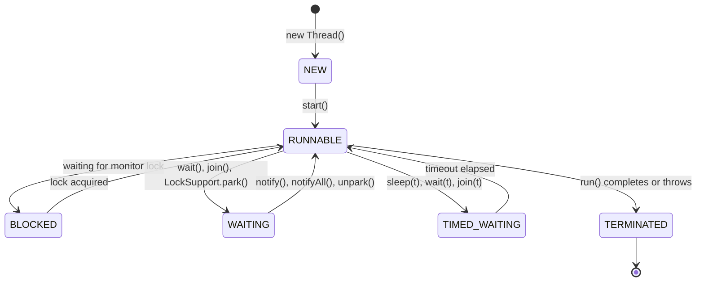

# Chapter 01: Multithreading & Modern Java Concurrency — Study Guide

> 📍 **Software Engineering (I4-GIC-S1)** — Department of ICE (GIC), ITC / Techno  
> 📄 **Lecture Slides**: [`Lesson.pdf`](Lesson.pdf)  
> 📝 **Quiz Practice**: [`quiz_prep.md`](quiz_prep.md)  
> 🧭 **Navigation**: [📖 Syllabus](../readme.md) | [📚 Global Study Guide](../study_guide.md) | [Chapter 02 ➡️](../C2-Spring%20Framework/study_guide.md)

---

## 1. Why This Matters

CPUs have multiple cores. Sequential code leaves all cores but one idle. Multithreading enables applications to handle multiple requests concurrently, compute parallel tasks faster, and keep user interfaces responsive.

## 2. Core Mental Models & Definitions

- **Process vs Thread**:
  - **Process**: An OS-level running program with an isolated address space. The JVM is one process.
  - **Thread**: An independent path of execution *inside* a process. Threads share the heap memory, but each thread has its own private **call stack**, **registers**, and **program counter**.
- **Platform Threads vs Virtual Threads (Project Loom / JDK 21+)**:
  - **Platform Thread**: 1-to-1 wrapper around an OS kernel thread. Costs ~1 MB of stack memory and heavy OS context switches. Limited to a few thousand threads.
  - **Virtual Thread**: Managed entirely by the JVM on the heap. Extremely lightweight (few KB). Millions can run concurrently. Perfect for high-throughput **I/O-bound** tasks (e.g., waiting for database queries or REST calls).
  - *Golden Rule*: Use Virtual Threads for blocking I/O; use Platform Threads with a sized pool for CPU-bound computations.

## 3. Thread Lifecycle State Machine



## 4. Critical Mechanisms & Code Patterns

### A. Starting a Thread

```java
// 1. Lambda implementing Runnable (Preferred for simple tasks)
Thread t1 = new Thread(() -> System.out.println("Running in parallel"));
t1.start(); // ALWAYS call start(), NEVER call run() directly!

// 2. Modern Virtual Thread (JDK 21+)
Thread vt = Thread.ofVirtual().start(() -> doBlockingHttpCall());
```

### B. Thread Safety: Race Conditions, Locks, and Visibility

- **Race Condition**: Two threads read and write shared mutable state concurrently without synchronization (e.g., `count++` consists of 3 distinct bytecode instructions: read, increment, write).
- **`synchronized`**: Guarantees **mutual exclusion** (only one thread enters the monitor at a time) AND **memory visibility** (flushes CPU caches on entry and exit).
- **`volatile`**: Guarantees **visibility** (reads/writes bypass CPU caches directly to main memory) and establishes a **happens-before** ordering. *Caution*: `volatile` does NOT make `count++` atomic!
- **Atomic Variables**: `AtomicInteger`, `AtomicReference` use hardware-level Compare-And-Swap (CAS) for lock-free atomicity.

### C. Inter-Thread Coordination

- **Low-level**: `wait()` and `notify()` must *always* be invoked inside a `synchronized` block on the locked monitor object.
- **High-level (Recommended)**: Use `BlockingQueue` (`LinkedBlockingQueue`, `ArrayBlockingQueue`) for producer-consumer patterns without manual locking.

### D. The Four Coffman Conditions for Deadlock

Deadlock can occur *if and only if* all four conditions hold simultaneously:

1. **Mutual Exclusion**: Resources cannot be shared.
2. **Hold and Wait**: A thread holding one resource waits for another.
3. **No Preemption**: Resources cannot be forcibly seized.
4. **Circular Wait**: Thread A waits for Thread B which waits for Thread A.

- *Fix*: Enforce a strict **global lock acquisition order** (e.g., always acquire Account locks in increasing order of `account.id`).

## 5. Professor's Traps & Rules of Thumb

> ⚠️ **Trap 1**: Calling `thread.run()` instead of `thread.start()`. `run()` executes sequentially on the *calling* thread. `start()` creates a new OS/JVM thread.  
> ⚠️ **Trap 2**: Thinking `worker.interrupt()` forcefully kills a thread. Java cancellation is **cooperative**; calling `interrupt()` only sets a boolean flag. If the worker doesn't check `Thread.currentThread().isInterrupted()`, it keeps running forever.  
> ⚠️ **Trap 3**: `CountDownLatch` vs `CyclicBarrier`. A `CountDownLatch` is a one-shot gate (cannot be reset once count hits zero); a `CyclicBarrier` can be reused over and over.

---

## 🎯 Next Steps & Practice

- 📝 Test your understanding with the **10 Official Slide Quiz Questions**:
  👉 **[Go to Chapter 01 Quiz Preparation (`quiz_prep.md`)](quiz_prep.md)**
- 🏠 Back to main course directory:
  👉 **[Software Engineering Repository Overview (`readme.md`)](../readme.md)**
