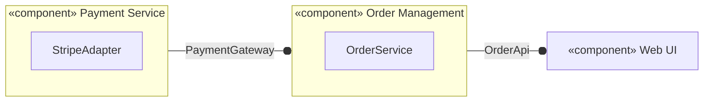

# Chapter 11: UML Component Diagrams & Modular Architectures — Study Guide

> 📍 **Software Engineering (I4-GIC-S1)** — Department of ICE (GIC), ITC / Techno  
> 📄 **Lecture Slides**: [`Lesson.pdf`](Lesson.pdf)  
> 📝 **Quiz Practice**: [`quiz_prep.md`](quiz_prep.md)  
> 🧭 **Navigation**: [⬅️ Chapter 10](../C10-Sequence%20Diagrams/study_guide.md) | [📖 Syllabus](../readme.md) | [📚 Global Study Guide](../study_guide.md) | [Chapter 12 ➡️](../C12-Deployment%20Diagrams/study_guide.md)

---

## 1. Why This Matters
A real-world system contains hundreds of classes. Component diagrams provide a high-level architectural view of deployable, replaceable software units and their contracts.

## 2. Interfaces & Connectors
- **Provided Interface ("Lollipop" `──○`)**: The API or services a component offers to external clients.
- **Required Interface ("Socket" `──)`)**: The dependencies a component needs to function.
- **Assembly Connector (`──○)`)**: Plugs a required socket directly into a provided ball (wiring dependencies).
- **Delegation Connector**: Routes messages from external ports to internal classes inside the component.



## 3. Architectural Styles & Governance
- **Hexagonal / Ports-and-Adapters**: All dependencies point *inward* toward the core domain. Adapters implement SPI ports declared by the domain.
- **Spring Modulith & ArchUnit**: Write automated unit tests that enforce architecture rules:
  ```java
  // ArchUnit: Fail build if there is any cyclic dependency between packages!
  slices().matching("edu.itc.shop.(*)..").should().beFreeOfCycles();
  ```

## 🚀 UML to Code & Testing Quick Reference

| UML 2.5 Element | Diagram | Java / Spring Construct | Testing Equivalent |
| :--- | :--- | :--- | :--- |
| **Provided Interface (`──○`)** | Component | Public Java Interface | Contract test (Pact) |
| **Required Interface (`──)`)** | Component | Injected SPI dependency | Mockito stub |


---

## 🎯 Next Steps & Practice

- 📝 Test your understanding with the **10 Official Slide Quiz Questions**:
  👉 **[Go to Chapter 11 Quiz Preparation (`quiz_prep.md`)](quiz_prep.md)**
- 🏠 Back to main course directory:
  👉 **[Software Engineering Repository Overview (`readme.md`)](../readme.md)**
