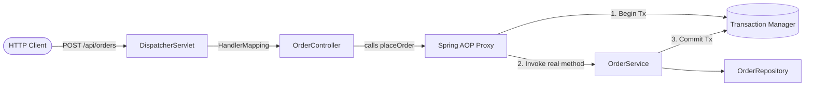

# Chapter 02: Spring Framework & Core Ecosystem — Study Guide

> 📍 **Software Engineering (I4-GIC-S1)** — Department of ICE (GIC), ITC / Techno  
> 📄 **Lecture Slides**: [`Lesson.pdf`](Lesson.pdf)  
> 📝 **Quiz Practice**: [`quiz_prep.md`](quiz_prep.md)  
> 🧭 **Navigation**: [⬅️ Chapter 01](../C1-MultiThread/study_guide.md) | [📖 Syllabus](../readme.md) | [📚 Global Study Guide](../study_guide.md) | [Chapter 03 ➡️](../C3-Hibernate%20Framework%20and%20Spring%20Data%20JPA/study_guide.md)

---

## 1. Why This Matters
Enterprise applications require database access, transaction management, web routing, validation, and security. Spring eliminates low-level plumbing code via **Inversion of Control (IoC)**, allowing developers to write clean, testable POJOs (Plain Old Java Objects).

## 2. Core Mental Models & Definitions
- **Inversion of Control (IoC)**: Instead of your class instantiating its dependencies (`new JdbcOrderRepository()`), the Spring container creates objects, configures them, and injects them.
- **Dependency Injection (DI)**: The mechanism of passing dependencies into an object.
- **Bean**: An object managed by the Spring IoC container.
- **Default Bean Scope**: **`singleton`** (exactly one instance per Spring ApplicationContext). Other scopes: `prototype` (new instance every request), `request`, `session`.

## 3. Three Injection Styles — Which to Use?
1. **Constructor Injection (STRONGLY RECOMMENDED)**:
   ```java
   @Service
   public class OrderService {
       private final OrderRepository orderRepo; // Immutable & final
       private final PaymentGateway paymentGateway;

       public OrderService(OrderRepository orderRepo, PaymentGateway paymentGateway) {
           this.orderRepo = orderRepo;
           this.paymentGateway = paymentGateway;
       }
   }
   ```
   *Why*: Dependencies are explicit, objects are immutable, and classes can be unit tested without starting the Spring container (`new OrderService(mockRepo, mockGateway)`).
2. **Setter Injection**: Useful only for optional dependencies.
3. **Field Injection (`@Autowired` on private fields)**: **DISCOURAGED**. Hides dependencies, complicates unit testing, and encourages violation of Single Responsibility.

## 4. Spring Boot Fundamentals
- **`@SpringBootApplication`**: An alias combining three critical annotations:
  1. `@Configuration`: Marks the class as a source of bean definitions.
  2. `@EnableAutoConfiguration`: Enables Spring Boot's smart auto-wiring based on classpath JARs.
  3. `@ComponentScan`: Scans the current package and all sub-packages for `@Component`, `@Service`, `@Repository`, `@Controller`.
- **Property Precedence Order (Highest Wins)**:
  1. Command-line arguments (`--server.port=7070`) ➔ **Wins over everything**
  2. Java System properties (`-Dserver.port=7070`)
  3. OS Environment variables (`SERVER_PORT=7070`)
  4. Profile-specific files (`application-prod.yml`)
  5. Default configuration (`application.yml`)

## 5. Web MVC, Transactions, and AOP



- **Declarative Transactions (`@Transactional`)**:
  - Spring wraps your `@Service` in a dynamic proxy.
  - *The Self-Invocation Pitfall*: If method `A()` calls `this.B()` inside the same class, and `B()` has `@Transactional`, **NO transaction is started** because `this.` bypasses the Spring proxy!
- **Exception Translation (`@Repository`)**:
  - `@Repository` automatically catches vendor-specific database SQLExceptions and translates them into Spring's unified, unchecked `DataAccessException` hierarchy.

---

## 🎯 Next Steps & Practice

- 📝 Test your understanding with the **10 Official Slide Quiz Questions**:
  👉 **[Go to Chapter 02 Quiz Preparation (`quiz_prep.md`)](quiz_prep.md)**
- 🏠 Back to main course directory:
  👉 **[Software Engineering Repository Overview (`readme.md`)](../readme.md)**
