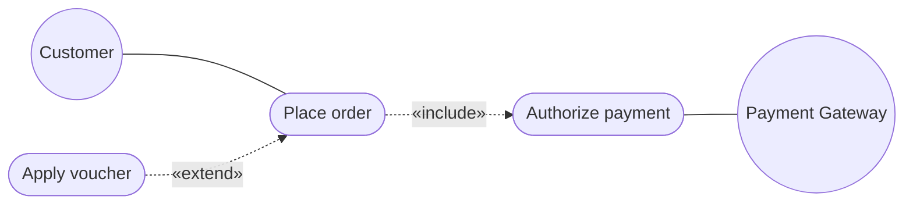

# Chapter 07: Introduction to UML & Use Case Diagrams — Study Guide

> 📍 **Software Engineering (I4-GIC-S1)** — Department of ICE (GIC), ITC / Techno  
> 📄 **Lecture Slides**: [`Lesson.pdf`](Lesson.pdf)  
> 📝 **Quiz Practice**: [`quiz_prep.md`](quiz_prep.md)  
> 🧭 **Navigation**: [⬅️ Chapter 06](../C6-Testing%20in%20Java%20Web%20Applications%20%28JUnit%2C%20Mockito%29/study_guide.md) | [📖 Syllabus](../readme.md) | [📚 Global Study Guide](../study_guide.md) | [Chapter 08 ➡️](../C8-Class%20Diagrams/study_guide.md)

---

## 1. Why This Matters
Before writing hundreds of lines of code, engineers and stakeholders must agree on what the system does, who interacts with it, and where the boundaries lie.

## 2. Core Mental Models & Definitions
- **UML 2.5.1**: Standard visual modeling language by the OMG (December 2017).
- **Two Diagram Families**:
  - **Structure Diagrams (Static)**: Class, Component, Deployment, Object, Package.
  - **Behavior Diagrams (Dynamic)**: Use Case, Activity, Sequence, State Machine.
- **Actors**:
  - **Primary Actors (Left)**: Initiate the use case to achieve a personal business goal (e.g., `Customer`, `Store Manager`).
  - **Supporting Actors (Right)**: Provide external services to our system (e.g., `Payment Gateway`, `Shipping Carrier`).
  - *Anti-Pattern*: Never draw internal software classes (e.g., `Database`, `Controller`) as actors!

## 3. Relationships in Use Case Diagrams
- **Association**: Solid line connecting an Actor to a Use Case.
- **`«include»`**: Mandatory, unconditional sub-flow. The base use case *cannot* succeed without executing the included use case. Arrow points from Base ➔ Included:
  `[Place order] ..> [Authorize payment] : «include»`
- **`«extend»`**: Optional, conditional branch. Executed only under certain conditions at specific extension points. Arrow points from Extension ➔ Base:
  `[Apply promotional voucher] ..> [Place order] : «extend»`
- **Generalization**: Inheritance between actors (`Registered Customer` inherits all associations of `Customer`).

## 4. Cockburn Goal Levels & Naming
- **Naming Rule**: Always use **Active Verb + Business Noun** at the **Sea Level (User Goal)**: `Place order`, `Track shipment` (Never `Order Management`, `Click button`, or `Login`).
- **Functional Decomposition Anti-Pattern**: Do NOT chain UI button clicks (`Enter login`, `Type password`, `Click pay`) as use cases with `«include»`! A use case represents an entire end-to-end user goal.

## 🚀 UML to Code & Testing Quick Reference

| UML 2.5 Element | Diagram | Java / Spring Construct | Testing Equivalent |
| :--- | :--- | :--- | :--- |
| **Actor** | Use Case | Client HTTP consumer | Playwright E2E test |
| **Use Case** | Use Case | `@Service` method | Gherkin / Cucumber BDD |

---

## 🎯 Next Steps & Practice

- 📝 Test your understanding with the **10 Official Slide Quiz Questions**:
  👉 **[Go to Chapter 07 Quiz Preparation (`quiz_prep.md`)](quiz_prep.md)**
- 🏠 Back to main course directory:
  👉 **[Software Engineering Repository Overview (`readme.md`)](../readme.md)**
