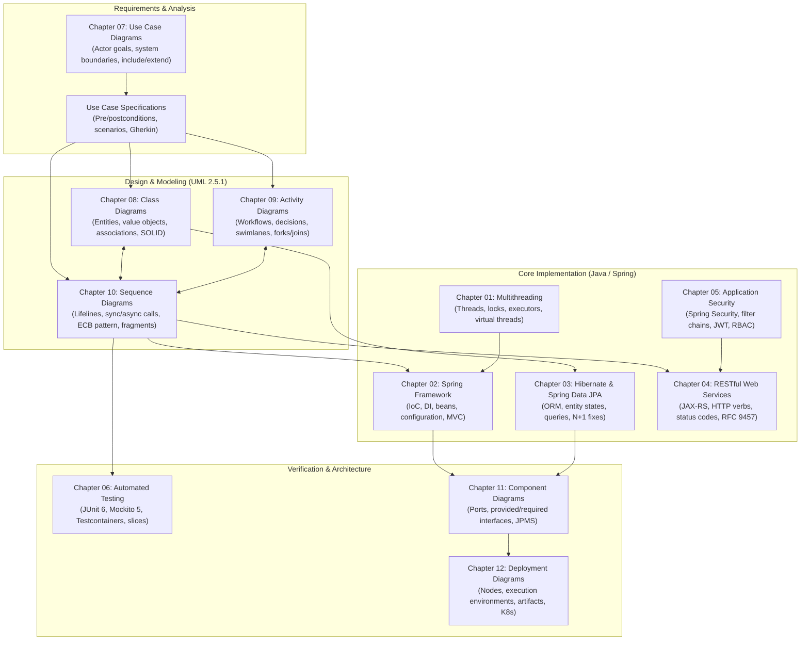

# Software Engineering (I4-GIC-S1) — Course Syllabus & Architectural Handbook

Welcome to the comprehensive course documentation for **Software Engineering (I4-GIC-S1)** at the **Institute of Technology of Cambodia (ITC / Techno)**, Department of Information and Communication Engineering (GIC).

This repository contains the complete curriculum, lecture slides, architectural reference models, and lab assignments for the course. The curriculum bridges **modern enterprise backend development in Java** with **formal software modeling using UML 2.5.1**, centered around a unifying enterprise case study: **The Distributed Online Shop**.

> 📖 **Quick Study Links**:
> 📘 **[Comprehensive Study Guide (For Reading & Understanding)](study_guide.md)** — Chapter-by-chapter concept summaries, mental models, code snippets, and rules of thumb.
> 📝 **[Official Quiz Preparation & Q&A Master (For Quiz Practice)](quiz_prep.md)** — All 120 official quiz questions from lecture slides with verified answers, rationales, and flashcards.

---

## 📑 Table of Contents

- [Course Overview & Architectural Roadmap](#-course-overview--architectural-roadmap)
  - [The Two Core Pillars](#the-two-core-pillars)
  - [Unifying Case Study: Enterprise Online Shop](#unifying-case-study-enterprise-online-shop)
  - [Complete Course Architecture & Traceability](#complete-course-architecture--traceability)
- [Course Module Directory & File Index](#-course-module-directory--file-index)
- [Detailed Module Breakdowns](#-detailed-module-breakdowns)
  - [Chapter 01: Multithreading & Modern Java Concurrency](#chapter-01-multithreading--modern-java-concurrency)
  - [Chapter 02: Spring Framework & Core Ecosystem](#chapter-02-spring-framework--core-ecosystem)
  - [Chapter 03: Hibernate Framework & Spring Data JPA](#chapter-03-hibernate-framework--spring-data-jpa)
  - [Chapter 04: RESTful Web Services (Jakarta REST & Jersey)](#chapter-04-restful-web-services-jakarta-rest--jersey)
  - [Chapter 05: Security in Java Web Applications (Spring Security & JWT)](#chapter-05-security-in-java-web-applications-spring-security--jwt)
  - [Chapter 06: Testing in Java Web Applications (JUnit 5/6 & Mockito)](#chapter-06-testing-in-java-web-applications-junit-56--mockito)
  - [Chapter 07: Introduction to UML & Use Case Diagrams](#chapter-07-introduction-to-uml--use-case-diagrams)
  - [Chapter 08: UML Class Diagrams & Domain Modeling](#chapter-08-uml-class-diagrams--domain-modeling)
  - [Chapter 09: UML Activity Diagrams & Workflow Modeling](#chapter-09-uml-activity-diagrams--workflow-modeling)
  - [Chapter 10: UML Sequence Diagrams & Dynamic Interactions](#chapter-10-uml-sequence-diagrams--dynamic-interactions)
  - [Chapter 11: UML Component Diagrams & Modular Architectures](#chapter-11-uml-component-diagrams--modular-architectures)
  - [Chapter 12: UML Deployment Diagrams & Infrastructure Topology](#chapter-12-uml-deployment-diagrams--infrastructure-topology)
- [Cross-Cutting Architectural Syntheses](#-cross-cutting-architectural-syntheses)
  - [UML to Java/Spring Code Mapping Matrix](#uml-to-javaspring-code-mapping-matrix)
  - [The Enterprise Technology Stack](#the-enterprise-technology-stack)

---

## 🧭 Course Overview & Architectural Roadmap

### The Two Core Pillars

The course curriculum is intentionally divided into two complementary learning phases that mirror real-world software engineering practice:

```text
┌────────────────────────────────────────────────────────────────────────┐
│                        PART I: SYSTEM IMPLEMENTATION                   │
│        (Building bottom-up: from low-level threads to full web stack)  │
│                                                                        │
│   [C01: Concurrency] ──▶ [C02: Spring IoC/MVC] ──▶ [C03: JPA/Hibernate]│
│                                                          │             │
│   [C06: Testing]     ◀── [C05: Security & JWT] ◀── [C04: REST APIs]    │
└───────────────────────────────────┬────────────────────────────────────┘
                                    │
                                    ▼
┌────────────────────────────────────────────────────────────────────────┐
│                        PART II: SOFTWARE ARCHITECTURE & MODELING       │
│        (Designing top-down: from stakeholder requirements to topology) │
│                                                                        │
│   [C07: Use Cases]   ──▶ [C08: Class Diagrams] ──▶ [C09: Activities]   │
│                                                          │             │
│   [C12: Deployment]  ◀── [C11: Components]     ◀── [C10: Sequences]    │
└────────────────────────────────────────────────────────────────────────┘
```

1. **Part I: Backend Engineering & Enterprise Systems (Chapters 01 – 06)**
   - Master concurrent execution with Java threads, memory synchronization, and modern virtual threads (Project Loom).
   - Structure production systems using Spring Framework, Inversion of Control (IoC), and Spring Boot.
   - Eliminate impedance mismatch with Jakarta Persistence (JPA 3.2), Hibernate 7, and Spring Data repositories.
   - Expose resource-oriented HTTP APIs with Jakarta REST 4.0 (JAX-RS) and Eclipse Jersey.
   - Protect systems against OWASP Top 10 vulnerabilities with Spring Security 7 and stateless JSON Web Tokens (JWT).
   - Safeguard maintainability through test pyramids with JUnit 6, Mockito 5, slice tests, and Testcontainers.

2. **Part II: Software Architecture & UML 2.5 Modeling (Chapters 07 – 12)**
   - Capture user requirements and system boundaries using UML Use Case diagrams and formal specifications.
   - Model domain models, entity relationships, and SOLID design patterns using UML Class diagrams.
   - Represent complex algorithmic and business workflows with UML Activity diagrams.
   - Validate temporal collaboration between controllers, services, and external gateways using UML Sequence diagrams.
   - Structure modular monoliths and microservices using UML Component diagrams and ports/adapters.
   - Map software artifacts to hardware, networks, Docker containers, and Kubernetes clusters using UML Deployment diagrams.

---

### Unifying Case Study: Enterprise Online Shop

Throughout all 12 chapters, concepts are applied against a single, coherent domain model: **The Online Shop System**.

- **Domain Entities**: `Customer`, `Order`, `OrderLine`, `Product`, `Payment`, `Shipment`.
- **Core Workflows**: Product discovery & catalog management, cart checkout, stock reservation, credit card payment processing via external gateways (Stripe/PayPal), order dispatch, and notification.
- **Architectural Styles Explored**: Layered Spring Monolith, Modular Monolith (Spring Modulith / JPMS), and Microservices.

---

### Complete Course Architecture & Traceability



---

## 📂 Course Module Directory & File Index

| Module Directory | Lecture Slides | Study Guide | Quiz Prep | Description / Scope |
| :--------------------------------- | :------------: | :---------: | :-------: | :------------------------------------------------------------------------------------- |
| [**C1-MultiThread**](C1-MultiThread/README.md) | [Lesson.pdf](C1-MultiThread/Lesson.pdf) | [📘 Guide](C1-MultiThread/study_guide.md) | [📝 Quiz](C1-MultiThread/quiz_prep.md) | Advanced Java concurrency, virtual threads, synchronization, executors, Maven primer |
| [**C2-Spring Framework**](C2-Spring%20Framework/README.md) | [Lesson.pdf](C2-Spring%20Framework/Lesson.pdf) | [📘 Guide](C2-Spring%20Framework/study_guide.md) | [📝 Quiz](C2-Spring%20Framework/quiz_prep.md) | Spring ecosystem, IoC/DI, Spring Boot, Spring MVC, transactions, Actuator |
| [**C3-Hibernate & Spring Data JPA**](C3-Hibernate%20Framework%20and%20Spring%20Data%20JPA/README.md) | [Lesson.pdf](C3-Hibernate%20Framework%20and%20Spring%20Data%20JPA/Lesson.pdf) | [📘 Guide](C3-Hibernate%20Framework%20and%20Spring%20Data%20JPA/study_guide.md) | [📝 Quiz](C3-Hibernate%20Framework%20and%20Spring%20Data%20JPA/quiz_prep.md) | ORM, entity lifecycle, associations, JPQL, locking, N+1 optimization, Flyway migrations |
| [**C4-RESTful Web Services**](C4-RESTful%20Web%20Services%20(JAX-RS)/README.md) | [Lesson.pdf](C4-RESTful%20Web%20Services%20(JAX-RS)/Lesson.pdf) | [📘 Guide](C4-RESTful%20Web%20Services%20(JAX-RS)/study_guide.md) | [📝 Quiz](C4-RESTful%20Web%20Services%20(JAX-RS)/quiz_prep.md) | Jakarta REST 4.0, Jersey, URI design, content negotiation, filters, pagination, caching |
| [**C5-Security in Web Apps**](C5-Security%20in%20Java%20Web%20Applications%20(Spring%20Security,%20JWT)/README.md) | [Lesson.pdf](C5-Security%20in%20Java%20Web%20Applications%20(Spring%20Security,%20JWT)/Lesson.pdf) | [📘 Guide](C5-Security%20in%20Java%20Web%20Applications%20(Spring%20Security,%20JWT)/study_guide.md) | [📝 Quiz](C5-Security%20in%20Java%20Web%20Applications%20(Spring%20Security,%20JWT)/quiz_prep.md) | Spring Security filter chain, BCrypt, RBAC, JWT issuance/validation, CORS/CSRF, OWASP Top 10 |
| [**C6-Testing in Web Apps**](C6-Testing%20in%20Java%20Web%20Applications%20(JUnit,%20Mockito)/README.md) | [Lesson.pdf](C6-Testing%20in%20Java%20Web%20Applications%20(JUnit,%20Mockito)/Lesson.pdf) | [📘 Guide](C6-Testing%20in%20Java%20Web%20Applications%20(JUnit,%20Mockito)/study_guide.md) | [📝 Quiz](C6-Testing%20in%20Java%20Web%20Applications%20(JUnit,%20Mockito)/quiz_prep.md) | Test Pyramid, JUnit 5/6, Mockito 5, Spring slices (@WebMvcTest, @DataJpaTest), Testcontainers |
| [**C7-UML & Use Case Diagrams**](C7-Introduction%20to%20UML%20and%20Use%20Case%20Diagrams/README.md) | [Lesson.pdf](C7-Introduction%20to%20UML%20and%20Use%20Case%20Diagrams/Lesson.pdf) | [📘 Guide](C7-Introduction%20to%20UML%20and%20Use%20Case%20Diagrams/study_guide.md) | [📝 Quiz](C7-Introduction%20to%20UML%20and%20Use%20Case%20Diagrams/quiz_prep.md) | UML 2.5 overview, actors, system boundaries, «include», «extend», Cockburn goal levels |
| [**C8-Class Diagrams**](C8-Class%20Diagrams/README.md) | [Lesson.pdf](C8-Class%20Diagrams/Lesson.pdf) | [📘 Guide](C8-Class%20Diagrams/study_guide.md) | [📝 Quiz](C8-Class%20Diagrams/quiz_prep.md) | Static structure, visibility, associations, composition vs aggregation, inheritance, SOLID mapping |
| [**C9-Activity Diagrams**](C9-Activity%20Diagrams/README.md) | [Lesson.pdf](C9-Activity%20Diagrams/Lesson.pdf) | [📘 Guide](C9-Activity%20Diagrams/study_guide.md) | [📝 Quiz](C9-Activity%20Diagrams/quiz_prep.md) | Workflow modeling, token semantics, decisions/merges, forks/joins, swimlanes, exception handling |
| [**C10-Sequence Diagrams**](C10-Sequence%20Diagrams/README.md) | [Lesson.pdf](C10-Sequence%20Diagrams/Lesson.pdf) | [📘 Guide](C10-Sequence%20Diagrams/study_guide.md) | [📝 Quiz](C10-Sequence%20Diagrams/quiz_prep.md) | Dynamic interactions, lifelines, activation bars, sync/async messages, ECB pattern, combined fragments |
| [**C11-Component Diagrams**](C11-Component%20Diagrams/README.md) | [Lesson.pdf](C11-Component%20Diagrams/Lesson.pdf) | [📘 Guide](C11-Component%20Diagrams/study_guide.md) | [📝 Quiz](C11-Component%20Diagrams/quiz_prep.md) | Modular architecture, ports, provided/required interfaces, JPMS, Spring Modulith, ArchUnit |
| [**C12-Deployment Diagrams**](C12-Deployment%20Diagrams/README.md) | [Lesson.pdf](C12-Deployment%20Diagrams/Lesson.pdf) | [📘 Guide](C12-Deployment%20Diagrams/study_guide.md) | [📝 Quiz](C12-Deployment%20Diagrams/quiz_prep.md) | Physical topology, nodes, execution environments, artifacts, Kubernetes mapping, high availability |

---

## 🔍 Detailed Module Breakdowns

---

### Chapter 01: Multithreading & Modern Java Concurrency

- **Primary Documents**:
  - [MultiThread.pdf](file:///C:/Desktop/Student%20Online%20(SO)/Techno/I4-GIC-A/I4-GIC-S1/Software%20engineering/C1-MultiThread/MultiThread.pdf) (30 pages)
  - [OOP-Chapter01.pdf](file:///C:/Desktop/Student%20Online%20(SO)/Techno/I4-GIC-A/I4-GIC-S1/Software%20engineering/C1-MultiThread/OOP-Chapter01.pdf) (14 pages)
- **Module Focus**: Java execution architecture, thread lifecycle, memory synchronization, and modern concurrency toolsets.

#### Key Learning Agenda & Core Concepts

1. **Processes vs Threads**: Operating system process separation (isolated address spaces) versus lightweight threads sharing heap memory with individual program counters, stacks, and registers.
2. **Mechanisms of Thread Creation**:
   - Subclassing `java.lang.Thread` vs implementing `java.lang.Runnable`.
   - Modern functional approaches using lambdas, anonymous inner classes, and `Callable<V>`.
   - Callback architectures ("call me when you are done") for decoupled asynchronous processing.
3. **Thread State Machine (`Thread.State`)**:
   - `NEW` ➔ `RUNNABLE` (ready or running) ➔ `BLOCKED` (waiting for lock) ➔ `WAITING` (indefinite notification) ➔ `TIMED_WAITING` (sleep/join with timeout) ➔ `TERMINATED`.
   - Programmatic state inspection using `thread.getState()`.
4. **Platform Threads vs Virtual Threads (Project Loom / JDK 21+)**:
   - OS-bound platform threads (~1MB stack, expensive context switching, limited to thousands).
   - Lightweight virtual threads (heap-allocated, managed by JVM, scaling to millions for high-throughput I/O).
5. **Synchronization & Memory Visibility**:
   - Race conditions and non-atomic compound operations (`count++`).
   - Mutual exclusion using `synchronized` blocks/methods and explicit locks (`ReentrantLock`).
   - Java Memory Model (JMM), cache coherency, the `volatile` keyword, and happens-before guarantees.
   - Lock-free atomic primitives: `AtomicInteger`, `AtomicReference`, `LongAdder`.
6. **Inter-Thread Coordination**:
   - Classical monitor methods: `wait()`, `notify()`, and `notifyAll()` within synchronized blocks.
   - High-level concurrent queues: `BlockingQueue` (`ArrayBlockingQueue`, `LinkedBlockingQueue`).
   - Explicit lock coordination: `Condition` variables with distinct wait sets ("not empty", "not full").
7. **Thread Pools & the Executor Framework**:
   - `ExecutorService`, `Executors.newFixedThreadPool()`, and custom `ThreadPoolExecutor` configurations.
   - Managing asynchronous computation with `Future<T>` and non-blocking pipeline chaining using `CompletableFuture`.
8. **Concurrency Hazards & Deadlock**:
   - Four conditions of deadlock (mutual exclusion, hold & wait, no preemption, circular wait).
   - Deadlock prevention via strict global lock acquisition ordering and timed `tryLock()`.
   - Cooperative cancellation via `Thread.interrupt()` and proper handling of `InterruptedException`.
9. **Concurrent Utilities & Collections**:
   - Thread-safe collections: `ConcurrentHashMap`, `CopyOnWriteArrayList`, `ConcurrentLinkedQueue`.
   - Synchronization barriers: `CountDownLatch` (one-shot gate), `CyclicBarrier` (reusable barrier), `Semaphore` (permit throttler).
10. **Build Tool Primer (Apache Maven 3.9)**:
    - Project Object Model (`pom.xml`), GAV coordinates (`groupId`, `artifactId`, `version`).
    - Standard directory layout (`src/main/java`, `src/test/java`).
    - Maven lifecycle phases: `validate` ➔ `compile` ➔ `test` ➔ `package` ➔ `verify` ➔ `install`.
11. **Hands-On Assessment**:
    - **Chapter Quiz**: 10 questions testing thread creation, lifecycle states, deadlock, and memory visibility.
    - **Lab-01**: 5 structured programming tasks + 1 concurrent throughput challenge.

---

### Chapter 02: Spring Framework & Core Ecosystem

- **Primary Document**: [Lesson.pdf](file:///C:/Desktop/Student%20Online%20(SO)/Techno/I4-GIC-A/I4-GIC-S1/Software%20engineering/C2-Spring%20Framework/Lesson.pdf) (25 pages)
- **Module Focus**: Inversion of Control, dependency injection, declarative application infrastructure, and the Spring Boot ecosystem.

1. **Spring Philosophy & History**: Evolution from heavyweight J2EE EJB containers (2003, Rod Johnson) to lightweight POJO programming wired by an Inversion of Control container.
2. **Build Systems (Maven vs Gradle 9)**: Declarative XML dependency graphs versus expressive Groovy/Kotlin DSLs with build caching and daemon processes.
3. **Spring Boot Architecture**:
   - Starter dependencies (e.g., `spring-boot-starter-webmvc`).
   - Bill of Materials (BOM) and parent POM dependency version management.
   - The executable "fat JAR" produced by `spring-boot-maven-plugin`.
4. **Pre-Spring Web Foundations**: Servlets (Tomcat 11 / Servlet 6.1 container), request dispatching, JSP syntax, Expression Language (`${expr}`), and JSTL tags.
5. **Database Connectivity Evolution**:
   - Raw JDBC boilerplate: `Connection`, `PreparedStatement`, `ResultSet`, connection pooling via HikariCP.
   - Spring JDBC abstractions: `JdbcTemplate` and fluent `JdbcClient`, custom `RowMapper`, and unchecked `DataAccessException` translation.
6. **Inversion of Control (IoC) & Dependency Injection (DI)**:
   - Eliminating direct object instantiation (`new`) in favor of container-managed lifecycle.
   - Comparison of injection styles: Field injection (`@Autowired` on private fields — discouraged), Setter injection (optional dependencies), and Constructor injection (strongly recommended: enforces immutability and testability).
7. **Bean Configuration & Lifecycle**:
   - Stereotype annotations: `@Component`, `@Service`, `@Repository`, `@Controller`, `@RestController`.
   - Explicit configuration classes using `@Configuration` and `@Bean` methods.
   - Bean scopes (`singleton` [default], `prototype`, `request`, `session`).
   - Lifecycle callbacks: `@PostConstruct` and `@PreDestroy`.
8. **Auto-Configuration & Profiles**:
   - `@SpringBootApplication` combining `@Configuration`, `@EnableAutoConfiguration`, and `@ComponentScan`.
   - Externalized configuration via `application.properties` / `application.yml` and hierarchical override rules.
   - Environment profiling via `@Profile` and `application-{profile}.yml`.
9. **Spring Web MVC**:
   - Front Controller architecture centered on `DispatcherServlet` and `HandlerMapping`.
   - Endpoint annotations: `@GetMapping`, `@PostMapping`, `@PathVariable`, `@RequestParam`, `@RequestBody`, `@ResponseStatus`.
   - Jakarta Validation (`@Valid`, `@NotNull`, `@Size`, `@Email`) and standardized RFC 9457 / RFC 7807 `ProblemDetail` responses.
10. **Declarative Services & Spring AOP**:
    - Declarative transaction demarcation via `@Transactional` and dynamic proxy generation.
    - Aspect-Oriented Programming (AOP) for cross-cutting concerns (logging, timing, security).
11. **Production Operations**:
    - Spring Boot Actuator health endpoints (`/actuator/health`, `/actuator/info`, `/actuator/metrics`).
    - Standard layered architecture: Controller ➔ Service ➔ Repository ➔ Database.
12. **Hands-On Assessment**:
    - **Chapter Quiz**: 10 questions covering IoC, injection styles, bean scopes, and transaction proxies.
    - **Lab-02**: 5 implementation tasks + 1 custom AOP timing challenge.

---

### Chapter 03: Hibernate Framework & Spring Data JPA

- **Primary Document**: [Lesson.pdf](file:///C:/Desktop/Student%20Online%20(SO)/Techno/I4-GIC-A/I4-GIC-S1/Software%20engineering/C3-Hibernate%20Framework%20and%20Spring%20Data%20JPA/Lesson.pdf) (27 pages)
- **Module Focus**: Object-Relational Mapping (ORM), Jakarta Persistence (JPA 3.2), Hibernate 7.4, repository abstractions, and query optimization.

1. **The Object-Relational Impedance Mismatch**:
   - Conceptual gap between object-oriented domains (pointers, polymorphism, collections, object identity) and relational databases (foreign keys, tables, normalization, primary keys).
   - Role of JPA 3.2 as the formal specification and Hibernate 7.4 as the reference implementation.
2. **Entity Mapping & Identifiers**:
   - Mapping classes with `@Entity`, `@Table`, `@Column`, and `@Enumerated(EnumType.STRING)`.
   - Primary key generation: `GenerationType.SEQUENCE` (supports statement batching) vs `IDENTITY` (disables JDBC batching).
   - Embeddable value objects using `@Embeddable` and `@Embedded`.
3. **Persistence Context & First-Level Cache**:
   - `EntityManager` as an identity map and change snapshot tracker.
   - Entity lifecycle states: `Transient/New` ➔ `Managed` ➔ `Detached` ➔ `Removed`.
   - Automatic dirty checking and transaction flush mechanisms.
4. **Association Mappings & Cascades**:
   - Mapping associations: `@ManyToOne`, `@OneToMany(mappedBy = "...")`, `@ManyToMany`.
   - Identifying the owning side (holds the foreign key) vs the inverse side.
   - Synchronizing bidirectional associations using entity helper methods (`addLine()`, `removeLine()`).
   - Cascading actions (`CascadeType.ALL`, `CascadeType.PERSIST`) and `orphanRemoval = true`.
5. **Fetching Strategies & Performance Hazards**:
   - `FetchType.LAZY` (load on demand via dynamic proxies) vs `FetchType.EAGER` (immediate join).
   - Best practice rule: Use `LAZY` as default for all associations (especially overriding `@ManyToOne`).
   - The **N+1 Query Problem**: Triggering 1 parent query followed by N child queries in a loop.
   - Solutions: JPQL `JOIN FETCH`, `@EntityGraph`, `@BatchSize`, and DTO projections.
   - Avoiding `MultipleBagFetchException` by preferring `Set<T>` or `@OrderColumn` with `List<T>`.
6. **Querying Techniques**:
   - JPQL: Queries operating on Java entities rather than SQL tables (`from Order o where o.customer.email = :email`).
   - Criteria API: Type-safe dynamic querying backed by the Hibernate Annotation Processor static metamodel (`Order_.placedAt`).
7. **Spring Data JPA Repositories**:
   - Interfaces hierarchy: `Repository`, `CrudRepository`, `ListCrudRepository`, `JpaRepository`.
   - Query method derivation from method names (`findByStatusAndPlacedAtAfterOrderByPlacedAtDesc`).
   - Custom JPQL queries via `@Query` and write queries with `@Modifying`.
8. **Concurrency Control & Locking**:
   - Optimistic Locking: Non-blocking version tracking using `@Version`, throwing `OptimisticLockException` on concurrent modification.
   - Pessimistic Locking: Explicit database-level row locks using `@Lock(LockModeType.PESSIMISTIC_WRITE)` (`SELECT ... FOR UPDATE`).
9. **Pagination, Sorting & Projections**:
   - Requesting slices and pages with `Pageable` and `PageRequest.of(page, size, sort)`.
   - `Page<T>` (executes count query) vs `Slice<T>` (checks for next item via `limit + 1`, zero count query overhead).
   - Interface and Java Record DTO projections to eliminate unnecessary column selection.
10. **Database Schema Management & Migrations**:
    - Disabling automatic schema alteration (`ddl-auto = none` / `validate` in production).
    - Immutable, versioned SQL migration scripts with Flyway (`V1__init.sql`, `V2__orders.sql`).
11. **Hands-On Assessment**:
    - **Chapter Quiz**: 10 questions on identifier generation, entity states, fetch joins, and optimistic locking.
    - **Lab-03**: 5 persistence tasks + 1 repository query tuning challenge.

---

### Chapter 04: RESTful Web Services (Jakarta REST & Jersey)

- **Primary Document**: [Lesson.pdf](file:///C:/Desktop/Student%20Online%20(SO)/Techno/I4-GIC-A/I4-GIC-S1/Software%20engineering/C4-RESTful%20Web%20Services%20(JAX-RS)/Lesson.pdf) (29 pages)
- **Module Focus**: Roy Fielding's REST architectural style, Jakarta REST 4.0 (JAX-RS), Eclipse Jersey 4, Grizzly server, HTTP protocol design, and robust API contracts.

1. **REST Architectural Foundations**:
   - Architectural constraints: Uniform interface, stateless requests, cacheable responses, client-server decoupling, layered systems, code-on-demand.
   - Resource-oriented design: URIs identify nouns/resources (collections `/products`, singletons `/products/{id}`, sub-resources `/orders/{id}/lines`); HTTP methods provide the uniform verbs.
2. **HTTP Methods & Semantic Properties**:
   - `GET`: Safe, idempotent, cached retrieval.
   - `POST`: Unsafe, non-idempotent resource creation (returns `201 Created` with `Location` header).
   - `PUT`: Unsafe, idempotent complete replacement.
   - `PATCH`: Unsafe, partial resource mutation.
   - `DELETE`: Unsafe, idempotent resource removal (`204 No Content`).
3. **Jakarta REST 4.0 Annotation Model**:
   - Resource binding: `@Path`, `@GET`, `@POST`, `@PUT`, `@DELETE`.
   - Parameter extraction: `@PathParam`, `@QueryParam`, `@HeaderParam`, `@CookieParam`, `@Context` (`UriInfo`, `SecurityContext`).
   - Content negotiation: `@Consumes` and `@Produces` mapping to HTTP `Content-Type` and `Accept` headers.
4. **Serialization & Entity Binding**:
   - Marshalling/unmarshalling via Jakarta JSON Binding (JSON-B / Yasson), Jackson, and JAXB.
   - Custom `MessageBodyReader<T>` and `MessageBodyWriter<T>`.
   - Programmatic response construction using the fluent `Response.ok().entity(...).build()`.
5. **Runtime Interceptors & Filter Pipeline**:
   - `@PreMatching` container request filters (URL rewriting, early routing).
   - Post-matching `ContainerRequestFilter` (authentication, audit logging) and `ContainerResponseFilter` (CORS headers, caching).
   - Content transformation with `ReaderInterceptor` and `WriterInterceptor` (GZIP compression).
   - Scoping filter execution using custom `@NameBinding` annotations.
6. **Error Architecture & RFC 9457**:
   - Exception mapping via `@Provider public class CustomExceptionMapper implements ExceptionMapper<T>`.
   - Standardized error payloads adhering to RFC 9457 / RFC 7807 Problem Details (`type`, `title`, `status`, `detail`, `instance`).
   - Request payload validation via Jakarta Bean Validation (`@Valid`, `@NotNull`, `@Size`).
7. **Advanced Enterprise REST Patterns**:
   - HTTP Caching & Conditional Requests: `ETag` generation, validation with `If-None-Match`, and returning `304 Not Modified`.
   - Safe POST operations using custom `Idempotency-Key` headers backed by a deduplication store.
   - API versioning strategies: URI path (`/v1/`), custom request headers, or media types.
   - Pagination strategies: Offset/limit pagination with standard `Link` headers (`rel="next"`, `rel="prev"`).
   - Hypermedia as the Engine of Application State (HATEOAS) & Richardson Maturity Model (Levels 0–3).
8. **Documentation & Testing**:
   - OpenAPI 3.1 specification generation using MicroProfile OpenAPI annotations (`@Operation`, `@APIResponse`, `@Schema`).
   - Automated integration testing using `JerseyTest` and JUnit 6.
9. **Hands-On Assessment**:
    - **Chapter Quiz**: 10 questions on HTTP safety/idempotency, status codes, JAX-RS filters, and ETags.
    - **Lab-04**: 5 RESTful endpoint implementation tasks + 1 ETag caching challenge.

---

### Chapter 05: Security in Java Web Applications (Spring Security & JWT)

- **Primary Document**: [Lesson.pdf](file:///C:/Desktop/Student%20Online%20(SO)/Techno/I4-GIC-A/I4-GIC-S1/Software%20engineering/C5-Security%20in%20Java%20Web%20Applications%20(Spring%20Security,%20JWT)/Lesson.pdf) (26 pages)
- **Module Focus**: Enterprise web defense, authentication vs authorization, Spring Security 7 filter chain, stateless JWT authentication, and OWASP Top 10 mitigations.

1. **Core Security Axioms**:
   - Authentication ("Who are you?"): Credential verification.
   - Authorization ("What are you permitted to do?"): Access control.
   - Defense in depth: Protection against injection, forged requests, and data leakage.
2. **Spring Security Architecture**:
   - The servlet filter pipeline: `DelegatingFilterProxy` delegating to `FilterChainProxy` and configured `SecurityFilterChain` beans.
   - `SecurityContextHolder` holding the `SecurityContext` on a `ThreadLocal` per request.
   - The `Authentication` token: `Principal` (user identity), `Credentials` (wiped after login), and `Authorities` (granted permissions).
3. **Password Hashing & Credential Storage**:
   - Never store cleartext passwords.
   - Salted, slow key-derivation algorithms with configurable work factors (`BCryptPasswordEncoder`, Argon2).
   - Implementing `UserDetailsService` and `UserDetails` backed by Spring Data JPA.
4. **Authorization & Method Security**:
   - Roles (`ROLE_ADMIN`, `ROLE_CUSTOMER`) vs granular Authorities (`order:cancel`).
   - Hierarchical roles configured via `RoleHierarchy`.
   - Declarative method security via `@PreAuthorize("hasRole('ADMIN')")`, `@PostAuthorize`, and SpEL.
5. **Stateful vs Stateless Authentication**:
   - Session-based security: HTTP-only session cookies (`JSESSIONID`), server-side session memory, `SessionCreationPolicy.IF_REQUIRED`.
   - Stateless security: `SessionCreationPolicy.STATELESS`, eliminating session state for REST APIs.
6. **JSON Web Tokens (JWT) Deep Dive**:
   - JWT structure: Three Base64URL-encoded parts separated by dots (`Header.Payload.Signature`).
   - Standard claims (`sub`, `iss`, `exp`, `iat`) and custom role claims.
   - Cryptographic signing: Symmetric HMAC-SHA256 (`HS256`) with a shared secret vs Asymmetric RSA/ECDSA (`RS256`) using public/private key pairs.
   - Token authentication pipeline: Custom filter or `BearerTokenAuthenticationFilter` (Nimbus JOSE) extracting tokens, verifying signatures/expiry, and populating `SecurityContext`.
7. **Web Exploits & Defenses**:
   - Cross-Site Request Forgery (CSRF): Browser cookie auto-submission exploit; mitigated via CSRF tokens or disabled for purely stateless JWT-authenticated APIs.
   - Cross-Origin Resource Sharing (CORS): Preflight `OPTIONS` requests, configuring allowed origins, headers, and HTTP methods.
   - Clickjacking & Browser Security Headers: Enforcing `X-Frame-Options: DENY`, Content Security Policy (CSP), `X-Content-Type-Options: nosniff`, and `Strict-Transport-Security` (HSTS).
   - SQL Injection & XSS: Parameterized queries in JPA/JDBC, input validation via `@Valid`, and HTML output escaping.
8. **Secrets Management & Security Auditing**:
   - Externalizing sensitive keys (`JWT_SECRET`, database passwords) using environment variables, HashiCorp Vault, or Kubernetes Secrets (never committed to Git).
   - Security auditing: Logging authentication failures, role violations, and administrative actions; strictly redacting passwords, session tokens, and credit card numbers from logs.
9. **Testing Security**: Automated test support via `spring-security-test`, `@WithMockUser`, `@WithUserDetails`, and `SecurityMockMvcRequestPostProcessors.jwt()`.
10. **OWASP Top 10 (2021) Mapping**: Direct mapping of Broken Access Control (A01), Cryptographic Failures (A02), and Injection (A03) to Spring Security configurations.
11. **Hands-On Assessment**:
    - **Chapter Quiz**: 10 questions covering HTTP 401 vs 403, BCrypt, JWT structure, and CORS/CSRF configurations.
    - **Lab-05**: 5 security configuration tasks + 1 JWT refresh token rotation challenge.

---

### Chapter 06: Testing in Java Web Applications (JUnit 5/6 & Mockito)

- **Primary Document**: [Lesson.pdf](file:///C:/Desktop/Student%20Online%20(SO)/Techno/I4-GIC-A/I4-GIC-S1/Software%20engineering/C6-Testing%20in%20Java%20Web%20Applications%20(JUnit,%20Mockito)/Lesson.pdf) (28 pages)
- **Module Focus**: Test automation strategy, the Test Pyramid, JUnit 5/6 Jupiter, Mockito 5 test doubles, Spring test slices, and containerized integration testing.

1. **Testing Economics & The Test Pyramid**:
   - Fast feedback loops, executable specifications, and safe refactoring.
   - The defect cost curve: bugs caught in unit tests cost minutes; bugs caught in production cost thousands.
   - The Test Pyramid:
     - **Base (Unit Tests)**: Fast, plentiful, completely isolated (in-memory, no Spring context, milliseconds).
     - **Middle (Integration & Slice Tests)**: Targeted Spring slices, database interactions, HTTP client stubs.
     - **Peak (End-to-End Tests)**: Few, slow, full-stack journeys through browser/API (Playwright, Selenium).
2. **JUnit Jupiter Test Architecture**:
   - Lifecycle: `@BeforeAll` (static, once per class), `@BeforeEach` (fresh fixture before every test), `@Test`, `@AfterEach`, `@AfterAll`.
   - Clean test isolation (new test class instance instantiated per test method).
   - Assertions: Arrange-Act-Assert (AAA) pattern; JUnit assertions vs fluent, readable AssertJ assertions (`assertThat(order.getStatus()).isEqualTo(OrderStatus.PAID)`).
   - Data-Driven Testing: `@ParameterizedTest` with `@ValueSource`, `@CsvSource`, `@CsvFileSource`, and `@MethodSource`.
3. **Mockito 5 Test Doubles**:
   - Definitions: Dummies, Stubs, Mocks, Spies, and Fakes.
   - Isolating the unit under test using `@Mock`, `@InjectMocks`, and `@ExtendWith(MockitoExtension.class)`.
   - Stubbing behavior: `when(repo.findById(1L)).thenReturn(Optional.of(product))` and `doThrow()`.
   - Behavioral verification: `verify(repo, times(1)).save(any())`, `verifyNoInteractions()`, and strict verification with `inOrder()`.
   - Argument inspection using `ArgumentCaptor<T>` and `argThat()`.
4. **Spring Boot Test Slices**:
   - Testing Services: Pure JUnit + Mockito (no Spring context overhead).
   - Testing Controllers: `@WebMvcTest(OrderController.class)` using `MockMvc`, mocking service beans with `@MockitoBean` / `@MockBean`, verifying HTTP status and JSON responses (`jsonPath("$.status").value("NEW")`).
   - Testing Repositories: `@DataJpaTest`, configuring SQL statement inspection, and testing transactional rollbacks.
5. **Test Data Management & Fixtures**:
   - Avoiding brittle test fixtures using the Test Data Builder pattern and Object Mother pattern.
   - Pre-seeding database state with `@Sql(scripts = "/seed.sql", executionPhase = BEFORE_TEST_METHOD)`.
6. **Real-World Integration Testing**:
   - Eliminating in-memory H2 divergence: Real database testing using **Testcontainers** (`@Testcontainers`, `@Container static PostgreSQLContainer<?>`).
   - Mocking external HTTP clients using `MockRestServiceServer` and WireMock.
   - Full-stack testing with `@SpringBootTest(webEnvironment = RANDOM_PORT)` and `TestRestTemplate` / `RestClient`.
   - Spring TestContext framework caching: Sharing initialized Spring contexts across test classes to minimize test suite execution duration.
7. **Contract Testing, Coverage & CI**:
   - Consumer-Driven Contract testing with Pact (validating API provider/consumer expectations without end-to-end environments).
   - Code coverage metrics via JaCoCo (line coverage, branch coverage, instruction coverage).
   - Eliminating test smells (e.g., eliminating flaky `Thread.sleep()` in favor of Awaitility).
8. **Hands-On Assessment**:
    - **Chapter Quiz**: 10 questions on the test pyramid, Mockito verifications, test slices, and Testcontainers.
    - **Lab-06**: 5 testing implementation tasks + 1 Testcontainers PostgreSQL challenge.

---

### Chapter 07: Introduction to UML & Use Case Diagrams

- **Primary Document**: [Lesson.pdf](file:///C:/Desktop/Student%20Online%20(SO)/Techno/I4-GIC-A/I4-GIC-S1/Software%20engineering/C7-Introduction%20to%20UML%20and%20Use%20Case%20Diagrams/Lesson.pdf) (26 pages)
- **Module Focus**: UML 2.5.1 foundations, requirements engineering, system boundary definition, actor classification, and use case specifications.

1. **The Rationale for Visual Modeling**:
   - Bridging the gap between ambiguous natural language prose and overly detailed implementation code.
   - Martin Fowler's three modeling modes: *UML as Sketch* (informal whiteboard discussions), *UML as Blueprint* (detailed architectural design prior to coding), and *UML as Programming Language* (executable models).
2. **UML 2.5.1 Standard Overview**:
   - Standardized by the Object Management Group (OMG, December 2017).
   - 14 diagram types categorized into two distinct families:
     - **Structure Diagrams** (Static: Class, Component, Deployment, Object, Package, Composite Structure, Profile).
     - **Behavior Diagrams** (Dynamic: Use Case, Activity, Sequence, State Machine, Communication, Interaction Overview, Timing).
3. **Use Case Core Elements**:
   - System Boundary (`«subject»`): The boundary separating what is inside the software under design from external entities.
   - Actors: External entities interacting with the system (represented as stick figures).
   - Use Cases: Units of observable business value delivered to an actor (represented as horizontal ellipses).
   - Naming Conventions: Use cases must be named with an active verb phrase from the actor's perspective (`Place Order`, `Track Shipment`, never passive nouns like `Order Management`).
4. **Actor Classifications**:
   - **Primary Actors**: External actors who initiate the interaction to achieve a personal business goal (placed on the left of the diagram).
   - **Supporting / Secondary Actors**: External systems or organizations that provide services to the system (e.g., `Payment Gateway`, `Email Provider`, `Warehouse ERP`; placed on the right).
   - System-as-Actor Anti-Pattern: Never model internal components, databases, or classes as actors.
5. **Relationships in Use Case Diagrams**:
   - **Association**: A solid line indicating direct interaction between an actor and a use case.
   - **«include»**: Mandatory, unconditional sub-routine reuse. The base use case cannot complete successfully without executing the included use case (dashed arrow pointing from base to included).
   - **«extend»**: Optional or conditional workflow insertion based on explicit guards (e.g., applying a promotional voucher during checkout). The dashed arrow points from the extension back to the base use case.
   - **Generalization**: Inheritance between actors (e.g., `Registered Customer` inherits all capabilities of `Guest Customer`) or between use cases (e.g., `Card Payment` specializes `Pay for Order`).
6. **Cockburn Goal Levels & System Scope**:
   - Sky / Cloud Level: Enterprise summary context.
   - Kite Level: Multi-session business process summary.
   - **Sea Level (User Goal)**: The core level for use cases — a single sitting that delivers distinct business value.
   - Fish / Submarine Level: Sub-function utility steps (best modeled as internal steps or «include» fragments).
7. **Use Case Textual Specifications**:
   - A diagram ellipse is merely a title; the actual requirements live in the structured specification.
   - Formal specification anatomy: Use Case ID & Name, Primary Actor, Stakeholders & Interests, Preconditions (guaranteed truths before start), Minimal Guarantees (failure postconditions), Success Postconditions, Main Success Scenario (numbered steps), Extensions / Alternative Flows (e.g., `3a. Card declined`).
8. **Traceability to Code & Testing**:
   - Mapping Business Requirements (BR) ➔ Use Cases (UC) ➔ Acceptance Tests (Gherkin BDD Given-When-Then) ➔ JUnit Integration Tests.
9. **Modeling Anti-Patterns**:
   - Functional decomposition (creating micro-use cases for `Enter Password`, `Click Button`).
   - "Spiderweb" diagrams with tangled, overlapping dependency lines.
10. **Hands-On Assessment**:
    - **Chapter Quiz**: 10 questions on «include» vs «extend», primary vs supporting actors, and system boundaries.
    - **Lab-07**: 5 use case modeling tasks + 1 complete textual specification challenge.

---

### Chapter 08: UML Class Diagrams & Domain Modeling

- **Primary Document**: [Lesson.pdf](file:///C:/Desktop/Student%20Online%20(SO)/Techno/I4-GIC-A/I4-GIC-S1/Software%20engineering/C8-Class%20Diagrams/Lesson.pdf) (28 pages)
- **Module Focus**: Static structural modeling, object-oriented analysis, relationship typologies, SOLID design review, and mapping models to Java 25 & JPA 3.2.

1. **Purpose & Levels of Modeling**:
   - Modeling static system structure: classes, interfaces, attributes, operations, and relationships.
   - Three abstraction levels: Conceptual / Domain Model (analysis), Design Model (types, visibility, packages), and Implementation Model (one-to-one Java/JPA code mapping).
2. **Class Anatomy (Three Compartments)**:
   - **Top Compartment**: Class name with optional stereotype (`«interface»`, `«abstract»`, `«record»`, `«enumeration»`).
   - **Middle Compartment**: Attributes formatted as `[visibility] name : type [multiplicity] [= default] [{modifiers}]`.
   - **Bottom Compartment**: Operations formatted as `[visibility] name(param: Type) : ReturnType`.
3. **Visibility Notation**:
   - `+` Public
   - `-` Private
   - `#` Protected
   - `~` Package-private
4. **Relationship Taxonomy & Semantics**:
   - **Association**: Structural link between instances. Annotated with navigability arrows, role names, and multiplicities (`1`, `0..1`, `*`, `1..*`).
   - **Aggregation (`◇` hollow diamond)**: Shared whole-part relationship ("has-a"). The part can exist independently of the whole (e.g., a `Team` has `Players`).
   - **Composition (`◆` filled diamond)**: Strict composite whole-part relationship. The part's lifecycle is bound to the whole; deleting the whole destroys the part (e.g., an `Order` owns its `OrderLine` items).
   - **Generalization (`──▷` solid line, hollow triangle)**: Object-oriented inheritance ("is-a").
   - **Realization (`┈┈▷` dashed line, hollow triangle)**: Contractual implementation of an interface.
   - **Dependency (`┈┈>` dashed arrow)**: Weakest relationship ("uses-a"). Indicates that a change in the supplier may force a change in the client (used for method parameters, return types, local variables, or factory creations).
5. **Domain Modeling with SOLID Principles**:
   - **Single Responsibility Principle (SRP)**: Ensuring classes represent one cohesive bundle of responsibilities (splitting monolithic classes with 15+ disparate methods).
   - **Open/Closed Principle (OCP)**: Extensibility through interfaces and the Template Method pattern without modifying existing classes.
   - **Liskov Substitution Principle (LSP)**: Derived classes must remain substitutable for base types without breaking contracts.
   - **Interface Segregation Principle (ISP)**: Decomposing bloated interfaces into role-specific contracts.
   - **Dependency Inversion Principle (DIP)**: High-level modules depending on abstractions rather than concrete low-level implementations.
6. **Packages & Architectural Namespaces**:
   - Grouping classes into namespaces (`edu.itc.shop.domain`, `edu.itc.shop.infrastructure`).
   - Enforcing inward dependency directions and preventing package dependency cycles.
7. **Mapping UML to Java 25 & Jakarta Persistence 3.2**:
   - UML Class ➔ Java `@Entity` class.
   - UML Value Object ➔ Java `record` with `@Embeddable`.
   - UML Composition ➔ `@OneToMany(cascade = CascadeType.ALL, orphanRemoval = true)`.
   - UML Association ➔ `@ManyToOne(fetch = FetchType.LAZY)`.
   - UML Generalization ➔ JPA `@Inheritance(strategy = InheritanceType.JOINED)`.
8. **Hands-On Assessment**:
    - **Chapter Quiz**: 10 questions on aggregation vs composition, visibility symbols, navigability, and SOLID principles.
    - **Lab-08**: 5 class diagram design tasks + 1 SOLID refactoring challenge.

---

### Chapter 09: UML Activity Diagrams & Workflow Modeling

- **Primary Document**: [Lesson.pdf](file:///C:/Desktop/Student%20Online%20(SO)/Techno/I4-GIC-A/I4-GIC-S1/Software%20engineering/C9-Activity%20Diagrams/Lesson.pdf) (27 pages)
- **Module Focus**: Dynamic behavioral workflows, token flow semantics, branching logic, parallel execution, and business process modeling.

1. **Behavioral Token-Flow Semantics**:
   - Semantics based on Petri nets: execution is driven by discrete control and object tokens flowing along edges.
   - Action activation rule: An action executes when tokens arrive on all required incoming edges, and emits tokens on outgoing edges upon completion.
2. **Core Activity Nodes & Symbols**:
   - **Initial Node (`●` solid circle)**: Marks the start of workflow execution and generates the initial token.
   - **Activity Final Node (`⊙` bullseye circle)**: Terminates the entire activity and annihilates all active tokens across all branches.
   - **Flow Final Node (`⊗` circle with an X)**: Terminates a specific execution path without affecting concurrent branches.
   - **Action Node (rounded rectangle)**: Represents an atomic step (named with active verb + noun, e.g., `Reserve Stock`).
   - **Object Node (sharp rectangle)**: Represents data or entity state traveling through the workflow (e.g., `Order [placed]`), connected via object flow edges and action pins.
3. **Control Flow Branching & Synchronization**:
   - **Decision Node (`◇` diamond)**: 1 input, multiple outputs. Routes a single token along the path whose boolean `[guard]` condition evaluates to true. Guards must be mutually exclusive and collectively exhaustive.
   - **Merge Node (`◇` diamond)**: Multiple inputs, 1 output. Merges alternate paths back together; passes any arriving token directly without waiting.
   - **Fork Node (thick horizontal/vertical bar)**: 1 input, multiple outputs. Splits execution into concurrent parallel flows by duplicating tokens.
   - **Join Node (thick bar)**: Multiple inputs, 1 output. Synchronizes parallel flows by waiting for tokens to arrive on *all* incoming edges before releasing one output token.
4. **Swimlanes (Activity Partitions)**:
   - Allocating responsibilities across architectural layers, departments, or systems (e.g., `Customer`, `Web App`, `Payment Gateway`, `Warehouse ERP`).
5. **Iteration & Advanced Workflow Constructs**:
   - Looping: Structured using a merge node preceding a decision node with a backward feedback loop.
   - Expansion Regions (`«iterative»` vs `«parallel»`): Visualizing "for-each" processing over collections without explicit loops.
   - Interruptible Activity Regions: Dashed bounding boxes with a zig-zag lightning interrupting edge for handling cancellations, aborts, and timeouts.
   - Exception Handlers: Protected activity nodes paired with catch handlers to handle failure scenarios.
6. **Translating Workflows to Production Code**:
   - Mapping initial/final nodes to method entry and return points.
   - Mapping decisions and merges to `if / else` or `switch` statements.
   - Mapping forks and joins to `CompletableFuture.allOf()` or Java 21 Structured Concurrency.
7. **Hands-On Assessment**:
    - **Chapter Quiz**: 10 questions covering decision vs fork, token flow mechanics, swimlanes, and interruptible regions.
    - **Lab-09**: 5 activity modeling tasks + 1 complex returns handling workflow challenge.

---

### Chapter 10: UML Sequence Diagrams & Dynamic Interactions

- **Primary Document**: [Lesson.pdf](file:///C:/Desktop/Student%20Online%20(SO)/Techno/I4-GIC-A/I4-GIC-S1/Software%20engineering/C10-Sequence%20Diagrams/Lesson.pdf) (27 pages)
- **Module Focus**: Dynamic time-ordered object interactions, message semantics, Entity-Control-Boundary (ECB) patterns, combined interaction fragments, and test traceability.

1. **Temporal Interaction Semantics**:
   - Visualizing how objects collaborate to realize a single specific use case scenario.
   - Two-dimensional layout: Horizontal axis lists participants (lifelines); vertical axis represents the linear progression of time (flowing from top to bottom).
2. **Core Notation Elements**:
   - **Lifeline**: Participant head box (`name : Class`) with a dashed vertical stem.
   - **Activation Bar (Execution Specification)**: Thin vertical rectangle on a lifeline indicating active execution of a method.
   - **Synchronous Call (`──▶` solid line, filled arrowhead)**: Caller invokes an operation and blocks until execution completes and returns.
   - **Asynchronous Message (`──>` solid line, open stick arrowhead)**: Caller dispatches a message non-blockingly and continues execution immediately (e.g., `@Async`, message queues).
   - **Reply / Return Message (`┈┈>` dashed line, open arrowhead)**: Returns control and result values back to the caller.
   - **Object Creation & Destruction**: `«create»` message pointing directly at a newly instantiated lifeline box; a large `X` marking the termination/closing of a resource.
3. **The Entity-Control-Boundary (ECB) Architectural Pattern**:
   - **Actor**: The external user or triggering system.
   - **«boundary»**: Interaction points on the system edge (Spring `@RestController`, HTTP client adapters).
   - **«control»**: Application orchestrators and transaction managers (Spring `@Service`).
   - **«entity»**: Business models and persistence gateways (Spring `@Repository`, JPA `@Entity`).
4. **Combined Interaction Fragments (UML 2.5.1 §17.6)**:
   - Framed interaction boxes with operator labels and dashed dividing lines:
     - `alt`: Alternative execution paths (`if / else if / else`) based on mutually exclusive guards.
     - `opt`: Optional execution path (single `if` without `else`).
     - `loop`: Repeated execution with iteration limits or boolean guards `[while hasItems]`.
     - `par`: Parallel concurrent execution paths.
     - `break`: Exceptional exit breaking out of the enclosing frame (maps to Java `throw` or early `return`).
     - `critical`: Atomic critical section (executes without interleaving).
5. **Advanced Interaction Patterns**:
   - Self-calls: Internal helper method calls creating stacked, nested activation bars.
   - Asynchronous callbacks and webhooks (e.g., payment provider notifying an asynchronous webhook endpoint).
6. **Direct Code & Test Traceability**:
   - The first incoming message into a boundary directly defines the REST API endpoint and HTTP method.
   - Deriving Mockito unit tests directly from sequence diagrams:
     - Participant lifelines become `@Mock` dependencies.
     - Dashed return messages become `when(...).thenReturn(...)` stubs.
     - Solid call arrows become `inOrder.verify(...)` verification assertions.
   - Consistency rule: Every message label in a sequence diagram must correspond to a declared public operation on the receiver's class diagram.
7. **Hands-On Assessment**:
    - **Chapter Quiz**: 10 questions on activation bars, message arrows, combined fragments (`alt`, `opt`, `par`), and ECB patterns.
    - **Lab-10**: 5 sequence modeling tasks + 1 webhook callback interaction challenge.

---

### Chapter 11: UML Component Diagrams & Modular Architectures

- **Primary Document**: [Lesson.pdf](file:///C:/Desktop/Student%20Online%20(SO)/Techno/I4-GIC-A/I4-GIC-S1/Software%20engineering/C11-Component%20Diagrams/Lesson.pdf) (27 pages)
- **Module Focus**: Coarse-grained modular software units, interface contracts, ports and adapters, modular monoliths vs microservices, and architectural fitness tests.

1. **Component Abstraction**:
   - Moving beyond individual classes: A component is a modular, replaceable unit of functionality that encapsulates its internals and exposes explicit contracts (UML 2.5.1 §11.6).
2. **Interface Notations & Connectors**:
   - **Ports**: Small square boxes on the component boundary defining interaction points.
   - **Provided Interface ("Lollipop" / Ball `──○`)**: The public API or contract that the component implements and offers to callers.
   - **Required Interface ("Socket" `──)`)**: The external dependency or contract that the component expects in order to perform its work.
   - **Assembly Connectors (`──○)`)**: Plugging a provided interface directly into a required interface (representing dependency injection or library linking).
   - **Delegation Connectors**: Internal arrows forwarding messages between an external boundary port and internal implementation classes.
3. **Architectural Styles & Component Boundaries**:
   - **The Modular Monolith**: Multiple cohesive components packaged into a single deployable artifact (`shop.jar`), enforcing boundaries at compile/test time.
   - **Microservices Architecture**: Components mapped one-to-one to independent network services with isolated databases and network APIs.
   - **Hexagonal / Ports-and-Adapters Architecture**: Core domain business logic isolated from infrastructure technologies through explicit SPI ports and adapter implementations.
4. **Mapping Components to Java & Build Tools**:
   - Mapping components to Maven multi-modules (`shop-orders`, `shop-catalog`, `shop-payment`).
   - Java Platform Module System (JPMS `module-info.java`): Using `exports`, `requires`, `uses`, and `provides ... with` via `java.util.ServiceLoader`.
   - **Spring Modulith**: Structuring application packages into verified modules, utilizing `@ApplicationModuleListener` for event-driven inter-module communication.
5. **Architectural Governance & Quality Attributes**:
   - Enforcing Directed Acyclic Graphs (DAG): Detecting and breaking cyclic module dependencies.
   - Automated Architectural Fitness Testing: Using **ArchUnit** in CI to guarantee that controllers never bypass services or access repositories directly.
   - Dependency verification using `jdeps` and `mvn dependency:analyze`.
   - Comparison with the C4 Model (C4 Component & Container diagrams).
   - Documenting architectural evolution using **Architecture Decision Records (ADRs)** within the arc42 framework.
6. **Hands-On Assessment**:
    - **Chapter Quiz**: 10 questions on lollipops/sockets, assembly connectors, modular monoliths, and ArchUnit rules.
    - **Lab-11**: 5 component modeling tasks + 1 modular monolith refactoring challenge.

---

### Chapter 12: UML Deployment Diagrams & Infrastructure Topology

- **Primary Document**: [Lesson.pdf](file:///C:/Desktop/Student%20Online%20(SO)/Techno/I4-GIC-A/I4-GIC-S1/Software%20engineering/C12-Deployment%20Diagrams/Lesson.pdf) (27 pages)
- **Module Focus**: Physical topology, execution environments, artifact manifestations, cloud/container deployments, network zones, scalability, and high availability.

1. **Bridging Architecture to Infrastructure**:
   - While component diagrams answer *what* the software is built of, deployment diagrams answer *where* it executes physically and *how* nodes communicate.
2. **Core Notational Elements**:
   - **Nodes (3D Cubes)**: Computational resources.
     - `«device»`: Physical hardware machines, physical servers, client smartphones, or VMs.
     - `«executionEnvironment»`: Software environments hosting code execution (e.g., `JVM 25`, `Docker Engine`, `Tomcat 11`, `PostgreSQL 17`).
   - **Artifacts (Document Box icon)**: Physical manifestations of software components (`shop-1.0.jar`, `Dockerfile`, SQL scripts).
   - **Deployment Relationship (`«deploy»` dashed arrow)**: Direct assignment of an artifact to a target node.
   - **Communication Paths (Solid Lines)**: Network connections linking nodes, annotated with communication protocols, port numbers, and transport security (e.g., `HTTPS :443 [TLS 1.3]`, `JDBC :5432`, `AMQP :5672`).
3. **Enterprise Topologies & Network Zones**:
   - Classic Three-Tier Architecture: Presentation Tier (CDN / Reverse Proxy) ➔ Application Tier (Tomcat / Spring Boot) ➔ Data Tier (Database / Cache).
   - Network Security Zones:
     - Demilitarized Zone (DMZ): Public-facing load balancers (Nginx, AWS ALB).
     - Application Zone: Private subnet hosting application services.
     - Data Zone: Isolated database subnet protected by strict firewall rules.
4. **Modern Cloud, Container & Kubernetes Mapping**:
   - Docker Containerization: The container image is the `«artifact»`; the running container instance is an `«executionEnvironment»`.
   - Kubernetes on Deployment Diagrams:
     - Kubernetes Worker Node ➔ `«device»`.
     - Kubelet / Pod ➔ `«executionEnvironment»`.
     - Kubernetes Deployments, Services, and Ingress controllers modeled as UML nodes and routing artifacts.
5. **High Availability, Scalability & Failover**:
   - Reverse proxies and load balancers distributing traffic via `least_conn` or round-robin algorithms.
   - Stateless app servers clustered behind Nginx with externalized shared sessions in Redis.
   - Database clustering: Active primary (read-write) with automated failover and read replicas (read-only).
   - Horizontal Pod Autoscaling (HPA) governed by CPU/memory thresholds and Kubernetes liveness/readiness probes.
6. **Environment Parity & Deployment Specifications**:
   - The Golden Rule: Deploy the exact same immutable binary artifact (`shop-1.0.jar`) across Dev, Staging, and Production.
   - **Deployment Specification**: UML attached box declaring environment-specific parameters (`application-prod.yml`, JVM heap flags `-Xmx4g`, thread pool limits).
7. **Production Observability & Security Hardening**:
   - Modeling telemetry flows: Metrics export (Actuator ➔ Prometheus), distributed tracing (OpenTelemetry), and centralized logging (ELK / Loki).
   - Enforcing mutual TLS (mTLS) within cluster service meshes and restricting management endpoints.
8. **Synthesis of the Software Engineering Lifecycle**:
   - Tracing the complete development journey: from multithreaded Java foundations (Ch. 01) through Spring, JPA, REST, Security, and automated testing (Ch. 02–06) to comprehensive UML 2.5 modeling perspectives (Ch. 07–12).
9. **Hands-On Assessment**:
    - **Chapter Quiz**: 10 questions on device vs execution environment, deployment specifications, communication paths, and Kubernetes UML mappings.
    - **Lab-12**: 5 infrastructure deployment modeling tasks + 1 high-availability multi-region cluster design challenge.

---

## 🔄 Cross-Cutting Architectural Syntheses

### UML to Java/Spring Code Mapping Matrix

One of the central strengths of this curriculum is its rigorous, bi-directional traceability between abstract UML models and concrete Java/Spring code:

| UML 2.5 Modeling Element | Diagram Type | Java 25 & Spring Framework Counterpart | Verification / Testing |
| :--- | :--- | :--- | :--- |
| **Actor (Primary)** | Use Case | End user / Client HTTP consumer | End-to-End tests (Playwright) |
| **Actor (Supporting)** | Use Case | External API / Gateway (`PaymentGateway`) | WireMock / Mockito stubs |
| **Use Case** | Use Case | Spring `@Service` business use case method | Cucumber / Gherkin BDD tests |
| **Class with Identity** | Class | Jakarta Persistence `@Entity public class Order` | `@DataJpaTest` |
| **Value Object** | Class | Java `@Embeddable public record Money(...)` | Pure JUnit unit tests |
| **Composition (`◆`)** | Class | `@OneToMany(cascade = ALL, orphanRemoval = true)` | JPA lifecycle assertions |
| **Aggregation / Association** | Class | `@ManyToOne(fetch = FetchType.LAZY)` | N+1 query checks (`JOIN FETCH`) |
| **Generalization (`──▷`)** | Class | Java `extends` / JPA `@Inheritance(strategy = ...)` | Polymorphic unit tests |
| **Realization (`┈┈▷`)** | Class | Java `implements` interface | Mockito interface mocks |
| **Action Node** | Activity | Method statement or single service call | JUnit step execution |
| **Decision / Merge** | Activity | Java `if / else`, `switch`, or ternary expressions | Branch coverage (JaCoCo) |
| **Fork / Join** | Activity | `CompletableFuture.allOf()`, Virtual Threads | Concurrency / timeout tests |
| **Swimlane Partition** | Activity | Specific architectural layer, service, or external system | Architectural unit test |
| **Lifeline** | Sequence | Collaborator instance (`@Mock`, `@Service`, `@Component`) | `@InjectMocks` test subject |
| **Activation Bar** | Sequence | Active method execution call stack frame | InOrder verification |
| **Synchronous Message (`──▶`)** | Sequence | Direct Java method invocation (`service.process(...)`) | Standard unit execution |
| **Asynchronous Message (`──>`)** | Sequence | `@Async` method call or message queue event | `CompletableFuture` join test |
| **Boundary (`«boundary»`)** | Sequence | Spring `@RestController` or REST client adapter | `@WebMvcTest` with `MockMvc` |
| **Combined Fragment `alt`** | Sequence | Java `if ... else` conditional block | Parameterized branch test |
| **Combined Fragment `loop`** | Sequence | Java `for`, `while`, or Stream processing pipeline | Loop boundary test |
| **Component (`«component»`)** | Component | Maven module / JPMS module / Spring Modulith package | ArchUnit architecture rules |
| **Provided Interface (`──○`)** | Component | Public Java interface exposed in module API | API contract test (Pact) |
| **Required Interface (`──)`)** | Component | Injected SPI dependency port | Mocked adapter test |
| **Assembly Connector (`──○)`)** | Component | Spring IoC `@Autowired` bean wiring | `@SpringBootTest` context test |
| **Device Node (`«device»`)** | Deployment | Physical host, VM, or bare metal server | Infrastructure provisioning |
| **Execution Env (`«execEnv»`)** | Deployment | `JVM 25`, Docker Container, Tomcat 11, Kubernetes Pod | Docker / Container test |
| **Artifact (`«artifact»`)** | Deployment | Packaged executable `shop-1.0.jar` or Docker image | Container deployment test |
| **Communication Path** | Deployment | Network socket (HTTPS `:443`, JDBC `:5432`, TLS 1.3) | Port availability / ping checks |

---

### The Enterprise Technology Stack

The curriculum utilizes a modern, production-grade enterprise Java ecosystem:

```text
┌────────────────────────────────────────────────────────────────────────┐
│                        PRESENTATION & API LAYER                        │
│   • Spring MVC 7 / Jakarta REST 4.0 (Jersey 4)                         │
│   • Jakarta JSON-B (Yasson) / Jackson 2                                │
│   • Jakarta Bean Validation 3 (Hibernate Validator 9)                  │
│   • OpenAPI 3.1 Specification (SmallRye / Swagger UI)                  │
├────────────────────────────────────────────────────────────────────────┤
│                     SECURITY & OBSERVABILITY LAYER                     │
│   • Spring Security 7.1 (FilterChain, RBAC, Method Security)           │
│   • Stateless JSON Web Tokens (Nimbus JOSE / JWT)                      │
│   • Spring Boot Actuator (Health, Metrics, Micrometer, Prometheus)     │
├────────────────────────────────────────────────────────────────────────┤
│                       BUSINESS & DOMAIN LAYER                          │
│   • Java 21 / 25 LTS (Records, Sealed Types, Pattern Matching)         │
│   • Modern Concurrency (Virtual Threads, CompletableFuture)           │
│   • Spring Modulith / Java Platform Module System (JPMS)               │
├────────────────────────────────────────────────────────────────────────┤
│                         PERSISTENCE LAYER                              │
│   • Spring Data JPA (Repositories, Projections, Auditing)              │
│   • Hibernate ORM 7.4 / Jakarta Persistence 3.2 (JPA)                  │
│   • HikariCP Connection Pool                                           │
│   • Database Migrations: Flyway 10                                     │
│   • Relational Database: PostgreSQL 17                                 │
├────────────────────────────────────────────────────────────────────────┤
│                     TESTING & QUALITY ASSURANCE                        │
│   • JUnit Platform 6 / JUnit Jupiter 6.1                               │
│   • Mockito 5.23 (Mocks, Spies, InjectMocks, ArgumentCaptor)           │
│   • AssertJ Fluent Assertions                                          │
│   • Testcontainers (PostgreSQL, Redis)                                 │
│   • Architecture Verification: ArchUnit 1.3                            │
│   • Code Coverage: JaCoCo 0.8                                          │
├────────────────────────────────────────────────────────────────────────┤
│                   INFRASTRUCTURE & DEPLOYMENT                          │
│   • Build Automation: Apache Maven 3.9 / Gradle 9                       │
│   • Containerization: Docker / OCI Containers                          │
│   • Container Orchestration: Kubernetes 1.30 (Deployments, Ingress)    │
│   • Reverse Proxy & Load Balancer: Nginx (TLS termination)             │
│   • Distributed Caching: Redis 7                                       │
└────────────────────────────────────────────────────────────────────────┘
```

---

## 🛡️ Course Best Practices & Design Principles

Throughout all lessons and laboratory assignments, adhere to these key engineering tenets:

1. **Explicit Architecture over Implicit Convention**:
   - State module dependencies explicitly.
   - Enforce architectural boundaries at build time using ArchUnit and JPMS.
2. **Favor Constructor Injection & Immutability**:
   - Mark fields `private final`.
   - Never use field-level `@Autowired` on private members in production code.
3. **Default to LAZY Fetching in JPA**:
   - Avoid `FetchType.EAGER` to prevent Cartesian explosions and unintended object graph loading.
   - Fetch associations purposefully per use case using `JOIN FETCH` or `@EntityGraph`.
4. **Deny-by-Default Security**:
   - Always conclude security filter chains with `.anyRequest().denyAll()` or `.authenticated()`.
   - Never expose internal error traces or database exceptions to API consumers (RFC 9457 Problem Details).
5. **Honor the Test Pyramid**:
   - Prioritize fast, isolated unit tests without Spring context overhead for business logic.
   - Use focused Spring slices (`@WebMvcTest`, `@DataJpaTest`) for layer integration.
   - Reserve end-to-end tests for critical core customer journeys.
6. **Model Before You Code (and Keep Models Versioned)**:
   - Treat UML diagrams as living architectural code (stored as Mermaid or PlantUML in `docs/` alongside the source code).
   - Use sequence diagrams to design method signatures and unit test mocks before implementation.

---

*Curriculum managed by Department of Information and Communication Engineering (GIC), Institute of Technology of Cambodia (ITC).*
